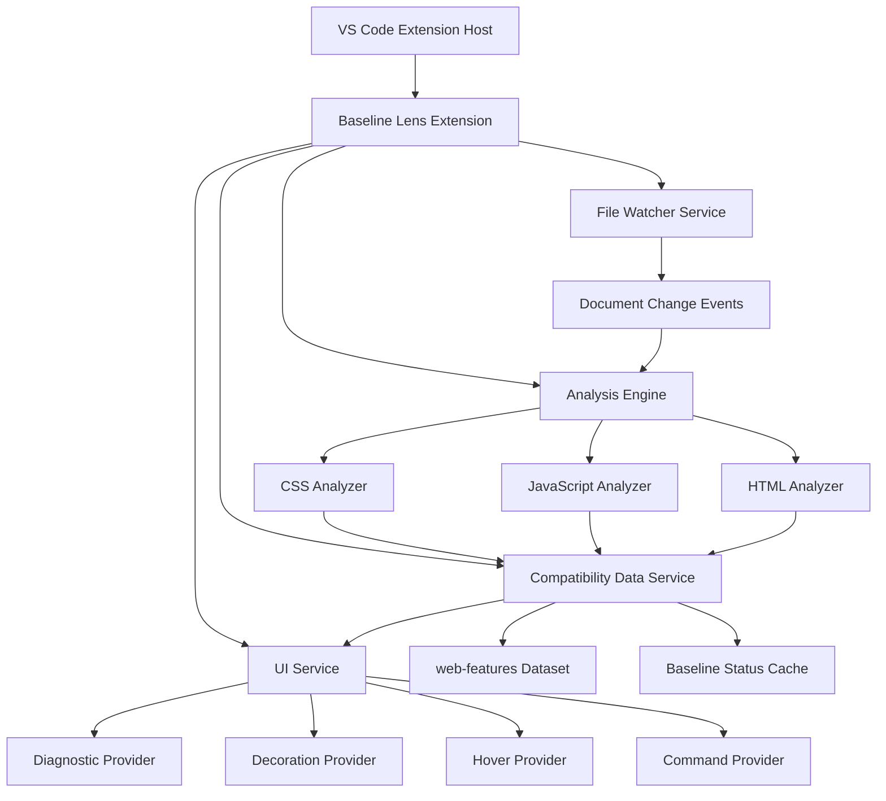

# Design Document

## Overview

Baseline Lens is a VS Code extension that provides real-time web feature compatibility checking by integrating Baseline data directly into the development workflow. The extension uses static analysis to detect modern web features in CSS, JavaScript, and HTML files, then displays inline compatibility indicators and diagnostic information to help developers make informed decisions about browser support.

The extension follows a modular architecture with separate analyzers for each web technology, a centralized compatibility data service, and VS Code API integrations for UI feedback. It operates entirely locally using the `web-features` npm package as the data source.

## Architecture

### High-Level Architecture



### Core Components

1. **Extension Entry Point**: Manages activation, deactivation, and service initialization
2. **Analysis Engine**: Orchestrates file parsing and feature detection across different analyzers
3. **Compatibility Data Service**: Manages web-features data loading, caching, and querying
4. **UI Service**: Handles all VS Code API interactions for visual feedback
5. **File Watcher Service**: Monitors document changes and triggers analysis
6. **Report Generator**: Creates project-wide compatibility reports

## Components and Interfaces

### 1. Extension Entry Point (`extension.ts`)

```typescript
interface ExtensionContext {
  activate(context: vscode.ExtensionContext): void;
  deactivate(): void;
}

interface ExtensionServices {
  analysisEngine: AnalysisEngine;
  compatibilityService: CompatibilityDataService;
  uiService: UIService;
  fileWatcher: FileWatcherService;
  reportGenerator: ReportGenerator;
}
```

**Responsibilities:**
- Register VS Code providers and commands
- Initialize core services
- Handle extension lifecycle
- Configure activation events for supported file types

### 2. Analysis Engine (`core/analysisEngine.ts`)

```typescript
interface AnalysisEngine {
  analyzeDocument(document: vscode.TextDocument): Promise<AnalysisResult>;
  analyzeProject(): Promise<ProjectAnalysisResult>;
}

interface AnalysisResult {
  features: DetectedFeature[];
  diagnostics: vscode.Diagnostic[];
  decorations: vscode.DecorationOptions[];
}

interface DetectedFeature {
  name: string;
  type: 'css' | 'javascript' | 'html';
  range: vscode.Range;
  baselineStatus: BaselineStatus;
  context?: string;
}
```

**Responsibilities:**
- Coordinate analysis across different file types
- Manage analyzer instances
- Aggregate results from multiple analyzers
- Handle incremental analysis for performance

### 3. File Type Analyzers

#### CSS Analyzer (`analyzers/cssAnalyzer.ts`)

```typescript
interface CSSAnalyzer {
  analyze(content: string, document: vscode.TextDocument): DetectedFeature[];
}

interface CSSFeatureDetector {
  detectProperties(ast: postcss.Root): DetectedFeature[];
  detectSelectors(ast: postcss.Root): DetectedFeature[];
  detectAtRules(ast: postcss.Root): DetectedFeature[];
  detectFunctions(ast: postcss.Root): DetectedFeature[];
}
```

**Implementation Details:**
- Uses PostCSS for parsing CSS content
- Detects CSS properties, selectors, at-rules, and functions
- Maps CSS features to web-features identifiers
- Handles CSS-in-JS and styled-components

#### JavaScript Analyzer (`analyzers/jsAnalyzer.ts`)

```typescript
interface JavaScriptAnalyzer {
  analyze(content: string, document: vscode.TextDocument): DetectedFeature[];
}

interface JSFeatureDetector {
  detectAPIs(ast: acorn.Node): DetectedFeature[];
  detectSyntax(ast: acorn.Node): DetectedFeature[];
  detectBuiltins(ast: acorn.Node): DetectedFeature[];
}
```

**Implementation Details:**
- Uses Acorn for JavaScript AST parsing
- Detects Web APIs, modern syntax, and built-in objects
- Handles TypeScript files through appropriate parsing
- Supports JSX and framework-specific syntax

#### HTML Analyzer (`analyzers/htmlAnalyzer.ts`)

```typescript
interface HTMLAnalyzer {
  analyze(content: string, document: vscode.TextDocument): DetectedFeature[];
}

interface HTMLFeatureDetector {
  detectElements(ast: parse5.Document): DetectedFeature[];
  detectAttributes(ast: parse5.Document): DetectedFeature[];
  detectInputTypes(ast: parse5.Document): DetectedFeature[];
}
```

**Implementation Details:**
- Uses parse5 for HTML parsing
- Detects HTML elements, attributes, and input types
- Handles template syntax for frameworks (Vue, Angular, Svelte)
- Extracts inline CSS and JavaScript for analysis

### 4. Compatibility Data Service (`services/compatibilityService.ts`)

```typescript
interface CompatibilityDataService {
  initialize(): Promise<void>;
  getFeatureStatus(featureId: string): BaselineStatus | null;
  searchFeatures(query: string): WebFeature[];
  getFeatureDetails(featureId: string): WebFeatureDetails | null;
}

interface BaselineStatus {
  status: 'widely_available' | 'newly_available' | 'limited_availability';
  baseline_date?: string;
  support: BrowserSupport;
}

interface WebFeatureDetails {
  name: string;
  description: string;
  mdn_url?: string;
  spec_url?: string;
  baseline: BaselineStatus;
}
```

**Implementation Details:**
- Loads web-features dataset on extension activation
- Implements efficient caching for feature lookups
- Provides fuzzy search capabilities for feature matching
- Handles dataset updates and versioning

### 5. UI Service (`services/uiService.ts`)

```typescript
interface UIService {
  updateDiagnostics(document: vscode.TextDocument, diagnostics: vscode.Diagnostic[]): void;
  updateDecorations(document: vscode.TextDocument, decorations: vscode.DecorationOptions[]): void;
  provideHover(document: vscode.TextDocument, position: vscode.Position): vscode.Hover | null;
  registerCommands(): void;
}

interface DiagnosticProvider {
  createDiagnostic(feature: DetectedFeature): vscode.Diagnostic;
  createCodeActions(diagnostic: vscode.Diagnostic): vscode.CodeAction[];
}
```

**Responsibilities:**
- Manage VS Code diagnostic collection
- Handle text decorations for inline indicators
- Provide hover information with compatibility details
- Register and handle extension commands

### 6. Report Generator (`services/reportGenerator.ts`)

```typescript
interface ReportGenerator {
  generateProjectReport(): Promise<CompatibilityReport>;
  exportReport(report: CompatibilityReport, format: 'json' | 'markdown'): string;
}

interface CompatibilityReport {
  summary: ReportSummary;
  features: FeatureUsage[];
  recommendations: string[];
  generatedAt: Date;
}

interface FeatureUsage {
  feature: WebFeatureDetails;
  locations: FileLocation[];
  riskLevel: 'low' | 'medium' | 'high';
}
```

## Data Models

### Core Data Structures

```typescript
// Feature detection result
interface DetectedFeature {
  id: string;                    // web-features identifier
  name: string;                  // Human-readable name
  type: 'css' | 'js' | 'html';   // Feature category
  range: vscode.Range;           // Location in document
  baselineStatus: BaselineStatus; // Compatibility information
  context?: string;              // Additional context (e.g., selector, property)
  severity: 'error' | 'warning' | 'info';
}

// Baseline compatibility status
interface BaselineStatus {
  status: 'widely_available' | 'newly_available' | 'limited_availability';
  baseline_date?: string;
  high_date?: string;
  low_date?: string;
  support: {
    [browser: string]: {
      version_added: string | boolean;
      version_removed?: string | boolean;
      notes?: string;
    };
  };
}

// Configuration settings
interface ExtensionConfig {
  enabledFileTypes: string[];
  supportThreshold: number;      // Minimum support percentage
  showInlineIndicators: boolean;
  diagnosticSeverity: 'error' | 'warning' | 'info';
  customBrowserMatrix?: string[];
  excludePatterns: string[];
}
```

## Error Handling

### Error Categories

1. **Parsing Errors**: Handle malformed CSS, JS, or HTML gracefully
2. **Data Loading Errors**: Fallback when web-features data is unavailable
3. **Performance Errors**: Timeout protection for large file analysis
4. **Configuration Errors**: Validate and provide defaults for invalid settings

### Error Handling Strategy

```typescript
interface ErrorHandler {
  handleParsingError(error: Error, document: vscode.TextDocument): void;
  handleDataLoadingError(error: Error): void;
  handleAnalysisTimeout(document: vscode.TextDocument): void;
  logError(error: Error, context: string): void;
}

// Graceful degradation approach
class RobustAnalyzer {
  async analyzeWithFallback(document: vscode.TextDocument): Promise<AnalysisResult> {
    try {
      return await this.fullAnalysis(document);
    } catch (error) {
      this.errorHandler.logError(error, 'analysis');
      return this.basicAnalysis(document); // Simplified analysis
    }
  }
}
```

## Testing Strategy

### Unit Testing

- **Analyzer Tests**: Verify feature detection accuracy for each file type
- **Compatibility Service Tests**: Test data loading and querying functionality
- **UI Service Tests**: Mock VS Code APIs and test provider implementations

### Integration Testing

- **End-to-End Workflow**: Test complete analysis pipeline from file change to UI update
- **Performance Tests**: Verify analysis completes within acceptable time limits
- **Cross-Platform Tests**: Ensure compatibility across different VS Code environments

### Test Data Strategy

```typescript
// Mock web-features data for testing
interface TestDataProvider {
  createMockFeature(status: BaselineStatus): WebFeature;
  createTestDocument(content: string, language: string): vscode.TextDocument;
  createExpectedDiagnostics(features: DetectedFeature[]): vscode.Diagnostic[];
}
```

### Performance Testing

- **Large File Handling**: Test with files up to 10MB
- **Project Scanning**: Test with projects containing 1000+ files
- **Memory Usage**: Monitor extension memory footprint
- **Startup Time**: Ensure extension activation under 2 seconds

## Implementation Considerations

### Performance Optimizations

1. **Incremental Analysis**: Only re-analyze changed portions of documents
2. **Caching Strategy**: Cache analysis results and feature lookups
3. **Debounced Updates**: Batch UI updates to reduce flicker
4. **Worker Threads**: Consider offloading heavy parsing to worker threads

### VS Code Integration Best Practices

1. **Activation Events**: Use specific activation events to minimize startup impact
2. **Diagnostic Management**: Properly clear diagnostics when files are closed
3. **Memory Management**: Dispose of resources and event listeners
4. **Settings Integration**: Respect VS Code workspace and user settings

### Extensibility Design

1. **Plugin Architecture**: Allow custom analyzers for additional file types
2. **Configuration API**: Provide programmatic configuration for teams
3. **Custom Rules**: Support user-defined compatibility rules
4. **Integration Hooks**: Enable integration with other extensions

This design provides a solid foundation for implementing Baseline Lens while maintaining performance, extensibility, and user experience standards expected in VS Code extensions.