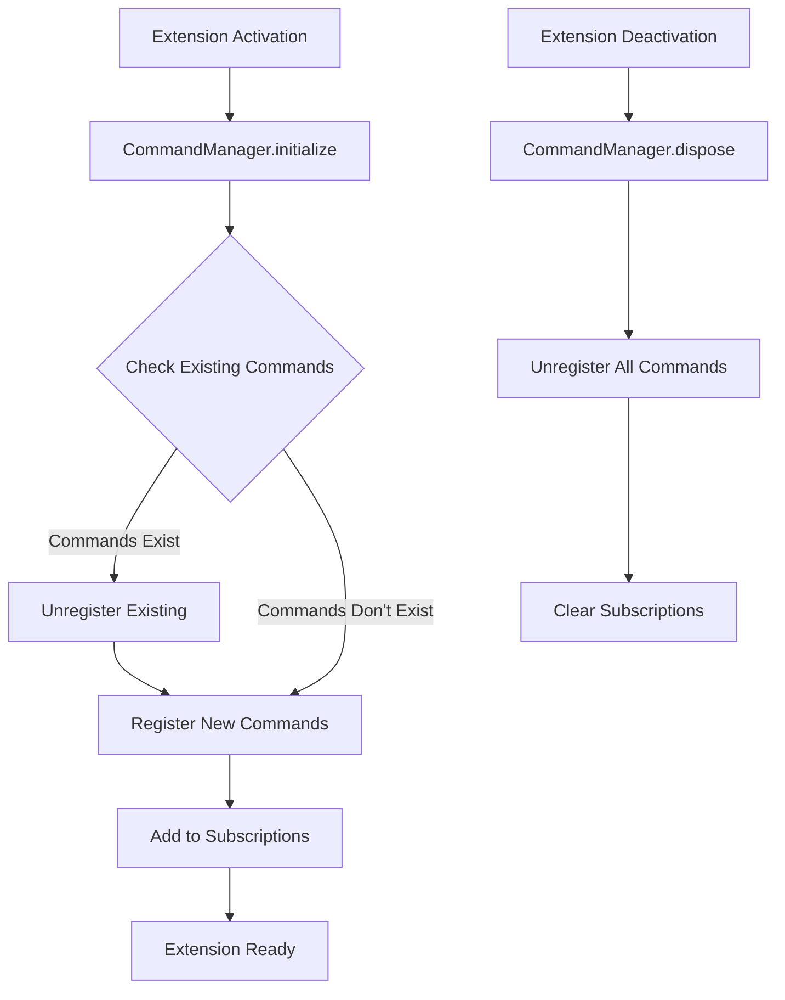
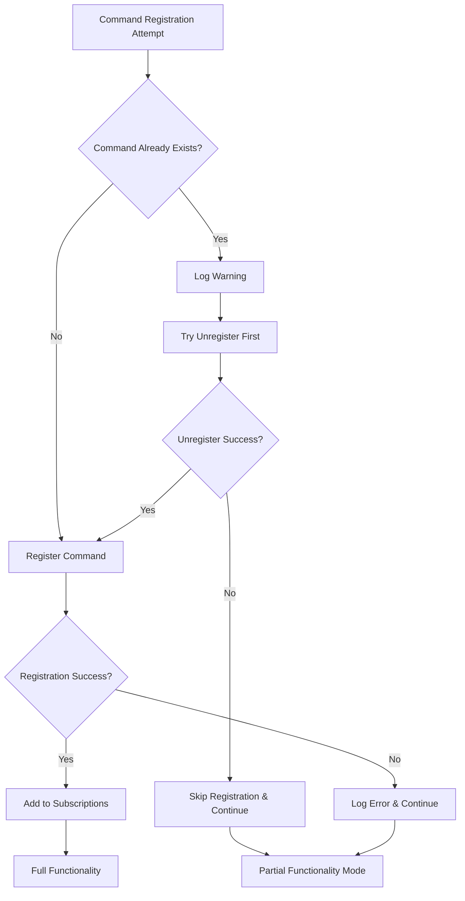

# Design Document

## Overview

The command registration issue occurs because VS Code maintains a global command registry, and when an extension is reloaded during development, the previous commands may still be registered. The solution involves implementing a robust command registration system that checks for existing commands, handles conflicts gracefully, and ensures proper cleanup during deactivation.

The design focuses on creating a CommandManager class that encapsulates all command registration logic and provides safe registration/deregistration methods.

## Architecture

### Command Registration Flow



### Error Handling Strategy



## Components and Interfaces

### 1. CommandManager Class

```typescript
interface CommandManager {
  initialize(context: vscode.ExtensionContext): Promise<void>;
  registerCommand(commandId: string, callback: (...args: any[]) => any): boolean;
  unregisterCommand(commandId: string): boolean;
  dispose(): void;
  isCommandRegistered(commandId: string): boolean;
}

class SafeCommandManager implements CommandManager {
  private registeredCommands: Map<string, vscode.Disposable>;
  private context: vscode.ExtensionContext;
  
  async initialize(context: vscode.ExtensionContext): Promise<void>;
  registerCommand(commandId: string, callback: (...args: any[]) => any): boolean;
  unregisterCommand(commandId: string): boolean;
  dispose(): void;
  isCommandRegistered(commandId: string): boolean;
}
```

### 2. Command Registration Utilities

```typescript
interface CommandRegistrationUtils {
  checkCommandExists(commandId: string): Promise<boolean>;
  safeUnregister(commandId: string): Promise<boolean>;
  validateCommandId(commandId: string): boolean;
}

interface ExtensionCommands {
  'baseline-lens.generateReport': () => Promise<void>;
  'baseline-lens.refreshAnalysis': () => Promise<void>;
  'baseline-lens.toggleInlineIndicators': () => Promise<void>;
  'baseline-lens.exportTeamConfig': () => Promise<void>;
  'baseline-lens.importTeamConfig': () => Promise<void>;
  'baseline-lens.resetConfiguration': () => Promise<void>;
  'baseline-lens.validateConfiguration': () => Promise<void>;
  'baseline-lens.showWalkthrough': () => Promise<void>;
  'baseline-lens.openDocumentation': () => Promise<void>;
  'baseline-lens.openCommunity': () => Promise<void>;
  'baseline-lens.showHover': () => void;
  'baseline-lens.showErrorStats': () => void;
}
```

### 3. Enhanced Extension Activation

```typescript
interface SafeExtensionActivation {
  activate(context: vscode.ExtensionContext): Promise<void>;
  deactivate(): Promise<void>;
  handleActivationError(error: Error): void;
}

class RobustExtensionManager implements SafeExtensionActivation {
  private commandManager: CommandManager;
  private services: ExtensionServices;
  
  async activate(context: vscode.ExtensionContext): Promise<void>;
  async deactivate(): Promise<void>;
  handleActivationError(error: Error): void;
}
```

## Data Models

### Command Registration State

```typescript
interface CommandRegistrationState {
  commandId: string;
  isRegistered: boolean;
  registrationAttempts: number;
  lastError?: Error;
  disposable?: vscode.Disposable;
}

interface ExtensionState {
  isActivated: boolean;
  activationAttempts: number;
  registeredCommands: Map<string, CommandRegistrationState>;
  lastActivationError?: Error;
}
```

### Configuration for Command Management

```typescript
interface CommandManagerConfig {
  maxRegistrationAttempts: number;
  enableFallbackMode: boolean;
  logRegistrationErrors: boolean;
  commandPrefix: string;
}
```

## Error Handling

### Command Registration Error Types

1. **DuplicateCommandError**: Command already exists in VS Code registry
2. **RegistrationFailedError**: VS Code API rejected the command registration
3. **InvalidCommandError**: Command ID format is invalid
4. **ContextNotAvailableError**: Extension context is not properly initialized

### Error Recovery Strategies

```typescript
class CommandRegistrationErrorHandler {
  handleDuplicateCommand(commandId: string): Promise<boolean> {
    // Try to unregister existing command first
    // If successful, retry registration
    // If failed, log warning and continue without this command
  }
  
  handleRegistrationFailed(commandId: string, error: Error): void {
    // Log detailed error information
    // Mark command as unavailable
    // Continue with other commands
  }
  
  handleInvalidCommand(commandId: string): void {
    // Log validation error
    // Skip registration for this command
  }
  
  enableFallbackMode(): void {
    // Disable non-essential commands
    // Ensure core functionality remains available
  }
}
```

### Graceful Degradation

When command registration fails, the extension should:

1. **Continue Activation**: Don't fail completely due to command issues
2. **Log Detailed Information**: Provide debugging information for developers
3. **Maintain Core Functionality**: Ensure analysis and UI features still work
4. **Provide User Feedback**: Inform users about limited functionality if needed

## Testing Strategy

### Unit Testing

```typescript
describe('CommandManager', () => {
  test('should register commands successfully', async () => {
    // Test normal command registration flow
  });
  
  test('should handle duplicate command registration', async () => {
    // Test behavior when command already exists
  });
  
  test('should clean up commands on disposal', async () => {
    // Test proper cleanup during deactivation
  });
  
  test('should continue with partial functionality on errors', async () => {
    // Test graceful degradation
  });
});
```

### Integration Testing

```typescript
describe('Extension Activation with Command Issues', () => {
  test('should activate successfully despite command conflicts', async () => {
    // Test extension activation when commands are already registered
  });
  
  test('should handle hot reload scenarios', async () => {
    // Test multiple activation/deactivation cycles
  });
  
  test('should maintain functionality with partial command registration', async () => {
    // Test that core features work even if some commands fail
  });
});
```

### Development Testing Scenarios

1. **Hot Reload Testing**: Repeatedly reload extension to test cleanup
2. **Conflict Simulation**: Manually register conflicting commands to test handling
3. **Error Injection**: Simulate VS Code API failures during registration
4. **Memory Leak Testing**: Ensure proper disposal prevents memory leaks

## Implementation Considerations

### Performance Optimizations

1. **Lazy Command Registration**: Register commands only when needed
2. **Batch Registration**: Register multiple commands in a single operation
3. **Caching**: Cache command existence checks to avoid repeated API calls
4. **Async Registration**: Use asynchronous patterns to avoid blocking activation

### VS Code API Best Practices

1. **Proper Subscription Management**: Always add disposables to context.subscriptions
2. **Error Boundary**: Wrap command callbacks in try-catch blocks
3. **Context Validation**: Ensure extension context is valid before registration
4. **Disposal Order**: Dispose services in reverse order of initialization

### Development Experience Improvements

1. **Detailed Logging**: Provide comprehensive logs for debugging
2. **Development Mode Detection**: Enhanced error handling in development
3. **Hot Reload Support**: Detect and handle development scenarios
4. **Diagnostic Commands**: Add commands to help debug registration issues

### Backward Compatibility

1. **Graceful Fallback**: Maintain compatibility with existing VS Code versions
2. **Feature Detection**: Check for API availability before using new features
3. **Progressive Enhancement**: Add new command features without breaking existing ones

This design ensures robust command registration that handles development scenarios gracefully while maintaining full functionality and providing excellent debugging capabilities for developers.