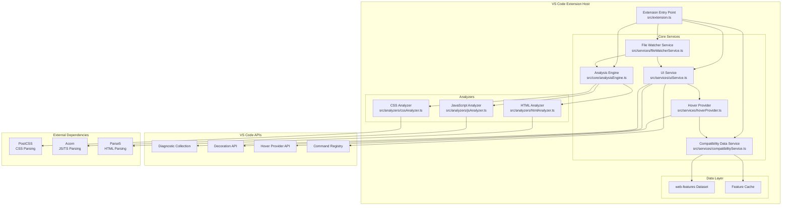
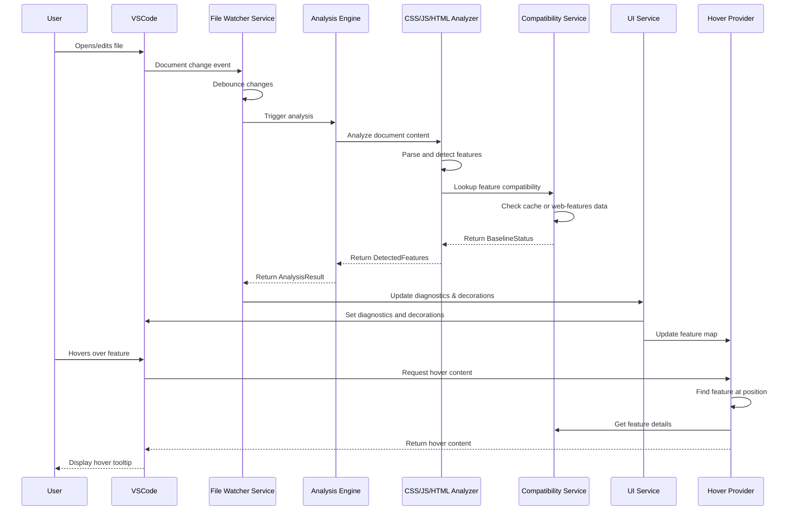
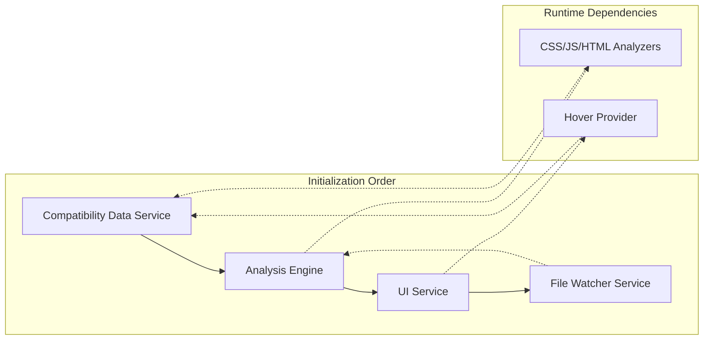

# Baseline Lens Architecture

## Overview

Baseline Lens is a VS Code extension that provides real-time browser compatibility analysis for web developers. It integrates Baseline compatibility data directly into the development workflow, detecting usage of modern web features and providing inline support status indicators.

## System Architecture



## Component Responsibilities

### Extension Entry Point (`src/extension.ts`)
- **Purpose**: Main extension lifecycle management
- **Responsibilities**:
  - Initialize core services in correct order
  - Register VS Code commands and providers
  - Handle extension activation and deactivation
  - Coordinate service dependencies

### Analysis Engine (`src/core/analysisEngine.ts`)
- **Purpose**: Orchestrates feature detection across file types
- **Responsibilities**:
  - Manage analyzer registration and routing
  - Coordinate document and project-wide analysis
  - Handle analysis timeouts and error recovery
  - Generate analysis performance metrics

### Compatibility Data Service (`src/services/compatibilityService.ts`)
- **Purpose**: Manages web-features dataset and compatibility lookups
- **Responsibilities**:
  - Load and process web-features dataset on startup
  - Provide feature status lookups with caching
  - Convert web-features data to internal BaselineStatus format
  - Handle dataset updates and cache invalidation

### UI Service (`src/services/uiService.ts`)
- **Purpose**: Manages VS Code UI integration
- **Responsibilities**:
  - Convert detected features to VS Code diagnostics
  - Create and manage inline decorations (✅, ⚠️, 🚫)
  - Register and coordinate hover providers
  - Handle diagnostic severity mapping

### File Watcher Service (`src/services/fileWatcherService.ts`)
- **Purpose**: Monitors document changes and triggers analysis
- **Responsibilities**:
  - Listen to document change, open, close, and save events
  - Implement debounced analysis to optimize performance
  - Handle incremental analysis for large files
  - Manage analysis scheduling and cancellation

### Hover Provider (`src/services/hoverProvider.ts`)
- **Purpose**: Provides detailed compatibility information on hover
- **Responsibilities**:
  - Generate rich hover content with browser support details
  - Cache hover content for performance
  - Provide educational context and recommendations
  - Generate quick links to documentation and resources

## Data Flow



## Service Dependencies



## Performance Considerations

### Analysis Performance
- **Debouncing**: 300ms delay for document changes to prevent excessive analysis
- **File Size Limits**: 10MB maximum file size for analysis
- **Timeout Protection**: 5-second timeout for large file analysis
- **Incremental Analysis**: Planned for files >1000 lines

### Caching Strategy
- **Feature Cache**: Compatibility lookups cached by feature ID
- **Search Cache**: Feature search results cached by query
- **Hover Cache**: Hover content cached for 5 minutes
- **Cache Cleanup**: Automatic cleanup when cache size exceeds limits

### Memory Management
- **Disposable Pattern**: All services implement proper disposal
- **Event Listener Cleanup**: Document event listeners properly disposed
- **Cache Limits**: Bounded caches with automatic cleanup

## Extension Configuration

The extension supports the following configuration options:

```typescript
interface ExtensionConfig {
    enabledFileTypes: string[];        // File types to analyze
    supportThreshold: number;          // Minimum support percentage
    showInlineIndicators: boolean;     // Show/hide inline decorations
    diagnosticSeverity: string;        // Diagnostic severity level
    excludePatterns: string[];         // File patterns to exclude
}
```

## Error Handling

### Graceful Degradation
- **Parser Failures**: Continue with partial analysis when parsing fails
- **Dataset Loading**: Fallback to limited functionality if web-features fails to load
- **Network Issues**: All operations work offline with cached data
- **Large Files**: Skip analysis for files exceeding size limits

### Error Recovery
- **Analysis Timeouts**: Cancel long-running analysis and provide feedback
- **Memory Pressure**: Clear caches and reduce analysis scope
- **Service Failures**: Restart individual services without full extension reload

## Testing Strategy

### Unit Tests
- Individual analyzer functionality
- Compatibility data service operations
- UI service diagnostic/decoration creation
- Hover provider content generation

### Integration Tests
- End-to-end analysis workflows
- Service coordination and dependencies
- VS Code API integration
- Performance benchmarks

### Performance Tests
- Large file analysis (up to 10MB)
- Project-wide analysis (1000+ files)
- Memory usage monitoring
- Startup time optimization

## Future Architecture Enhancements

### Planned Improvements
1. **Worker Thread Analysis**: Move heavy parsing to worker threads
2. **Incremental Analysis**: True incremental analysis for large files
3. **Language Server Protocol**: Migrate to LSP for better performance
4. **Streaming Analysis**: Process files as they're being typed
5. **Machine Learning**: Smart feature detection using ML models

### Extensibility Points
1. **Custom Analyzers**: Plugin system for additional file types
2. **Custom Data Sources**: Support for custom compatibility datasets
3. **Custom UI Providers**: Pluggable UI components
4. **Export Formats**: Additional report export formats