# Baseline Lens Process Diagrams

This document contains detailed process flow diagrams using Mermaid to illustrate how Baseline Lens works internally.

## Extension Lifecycle

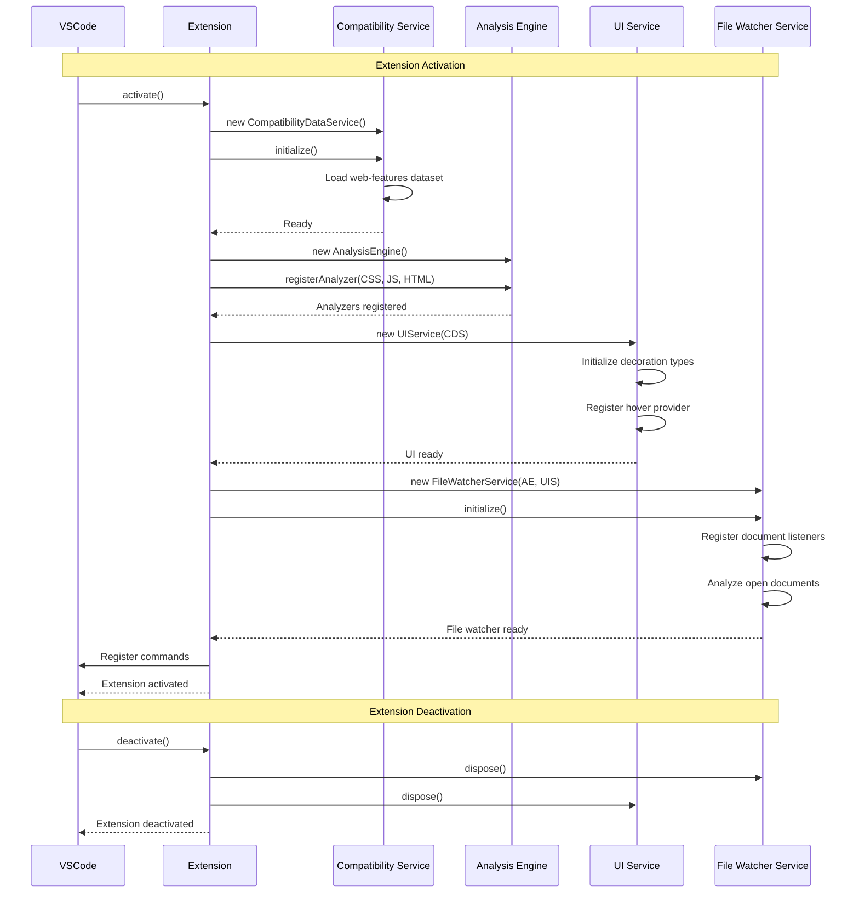

## Document Analysis Flow

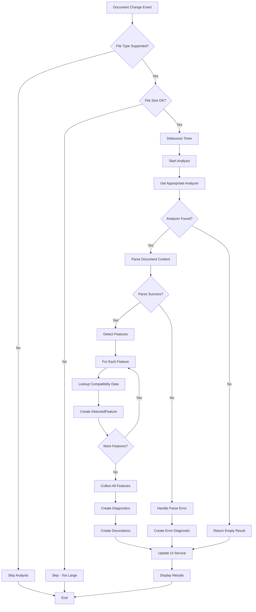

## Feature Detection Process

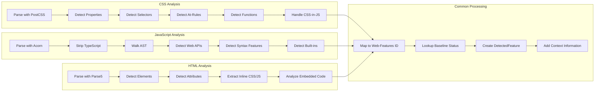

## Compatibility Data Service Flow

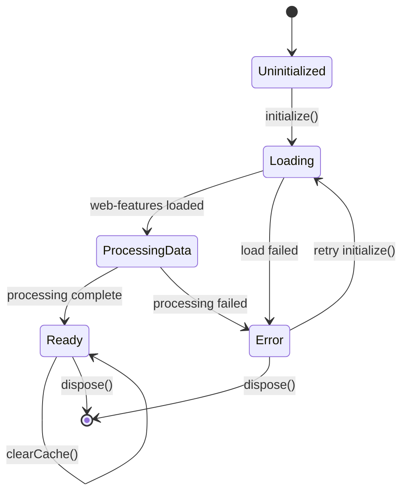

## File Watcher Service State Machine

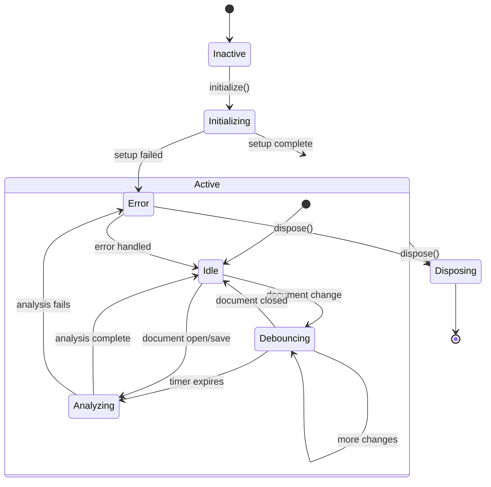

## UI Service Update Flow

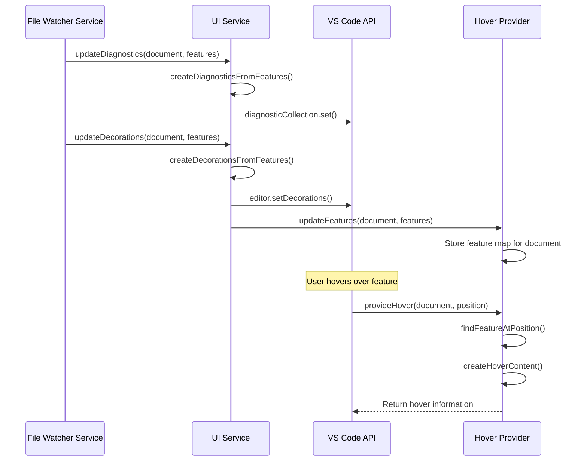

## Hover Provider Content Generation

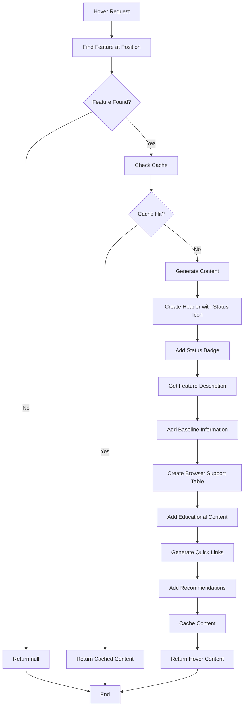

## Error Handling Flow

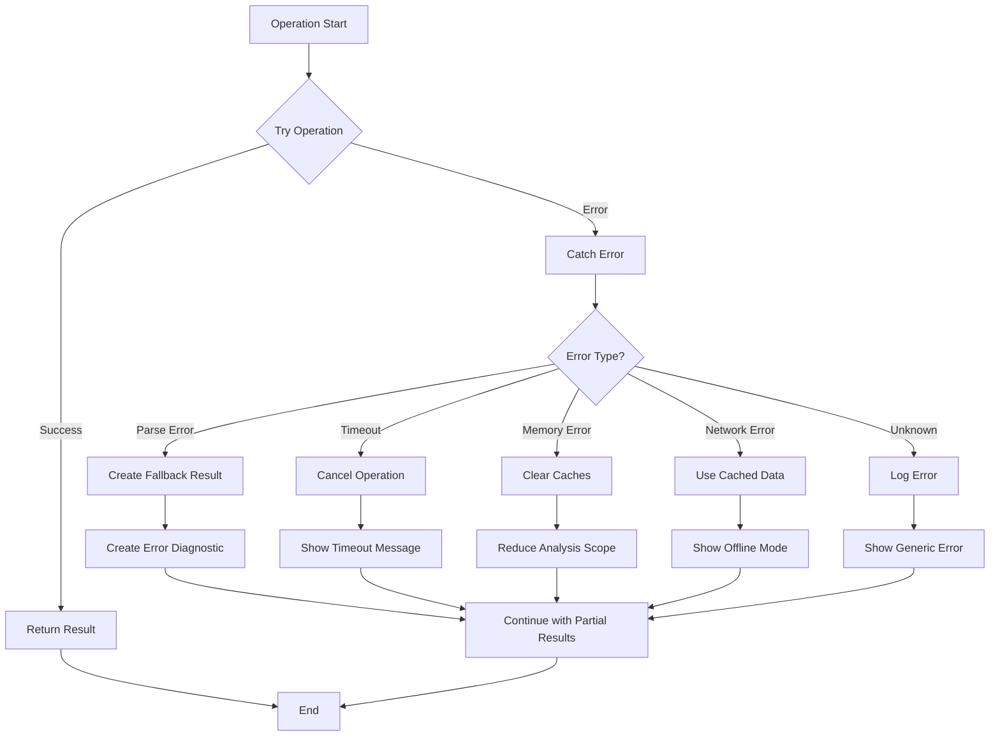

## Performance Optimization Flow

```mermaid
flowchart LR
    subgraph "Input Optimization"
        A1[File Size Check] --> A2[Content Validation]
        A2 --> A3[Language Detection]
    end
    
    subgraph "Processing Optimization"
        B1[Cache Lookup] --> B2[Debounced Analysis]
        B2 --> B3[Timeout Protection]
        B3 --> B4[Incremental Analysis]
    end
    
    subgraph "Output Optimization"
        C1[Result Caching] --> C2[UI Batching]
        C2 --> C3[Memory Cleanup]
    end
    
    A3 --> B1
    B4 --> C1
    
    subgraph "Monitoring"
        D1[Performance Metrics] --> D2[Memory Usage]
        D2 --> D3[Cache Statistics]
        D3 --> D4[Optimization Decisions]
    end
    
    C3 --> D1
    D4 --> A1
```

## Project Analysis Workflow

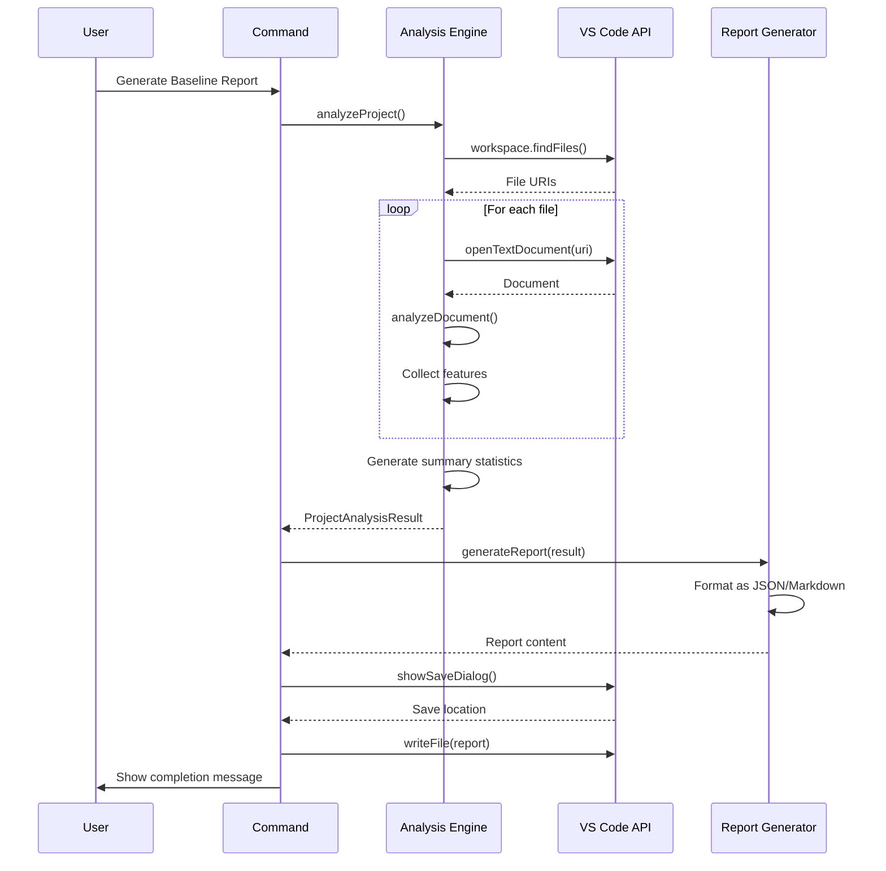

## Cache Management Strategy

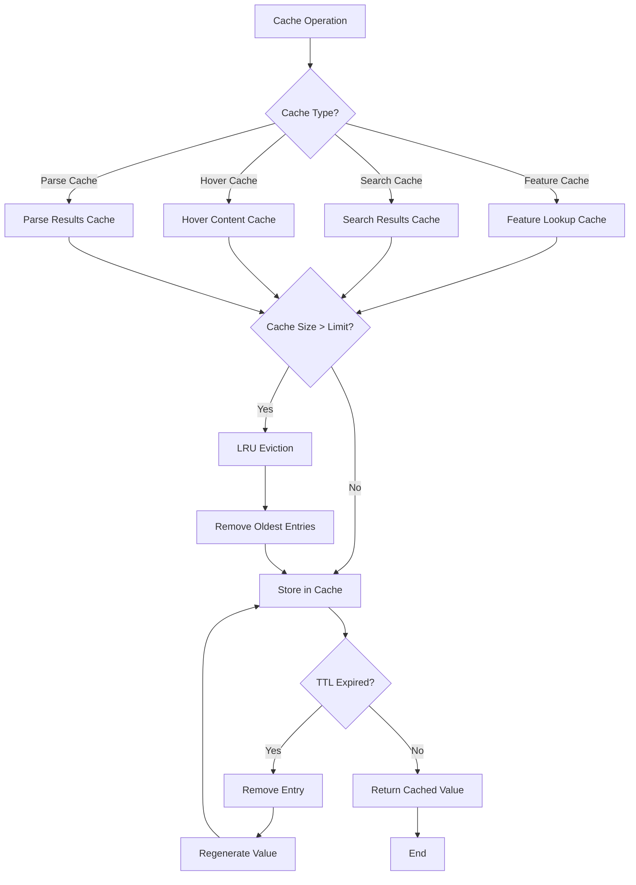

## Extension Configuration Flow

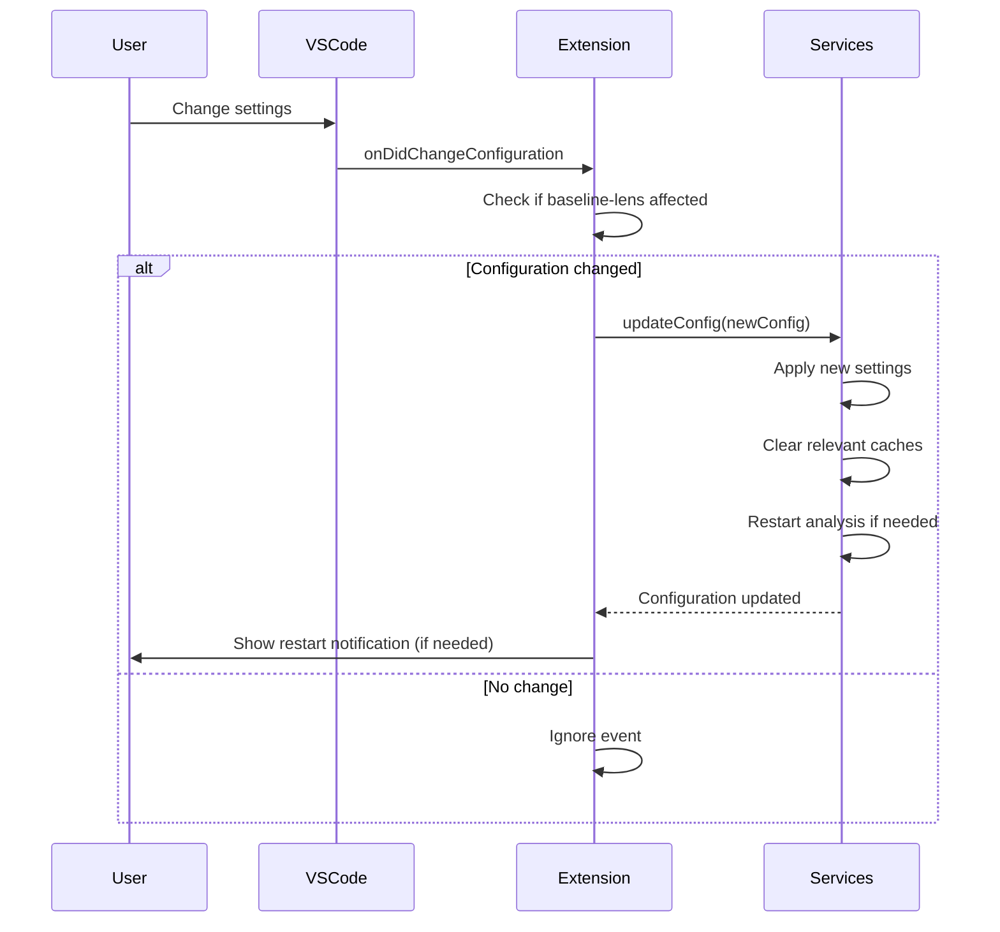

## Analyzer Registration Process

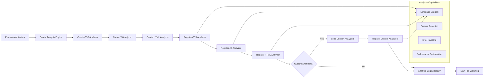

## Memory Management Lifecycle

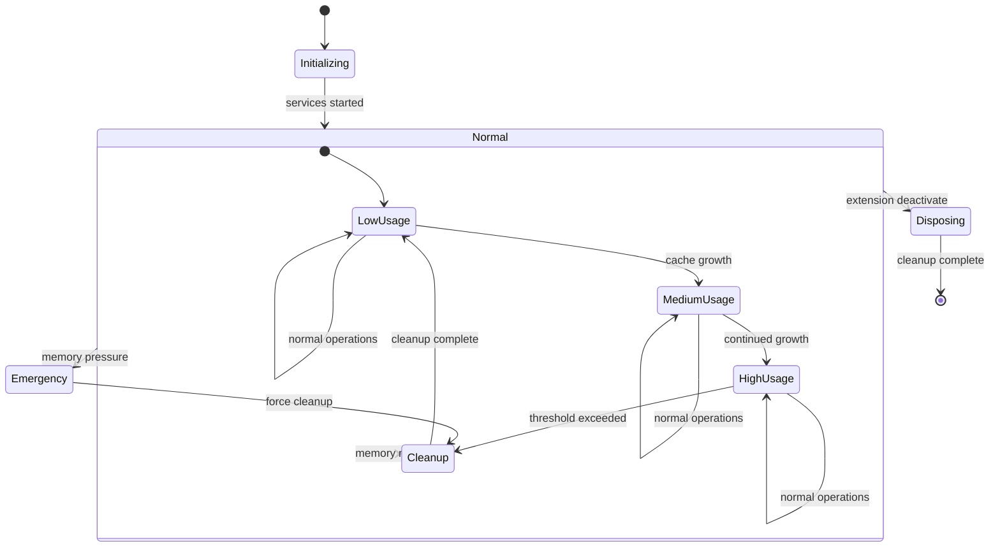